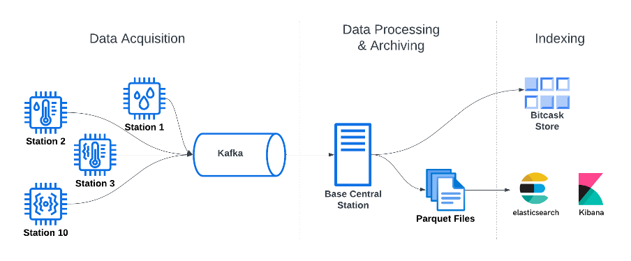
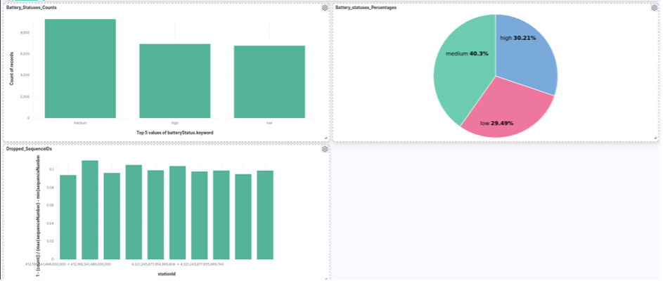
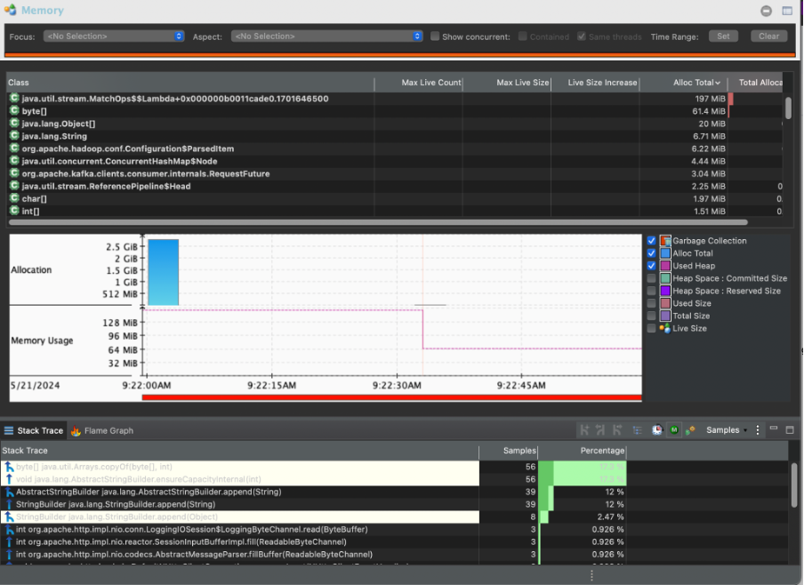
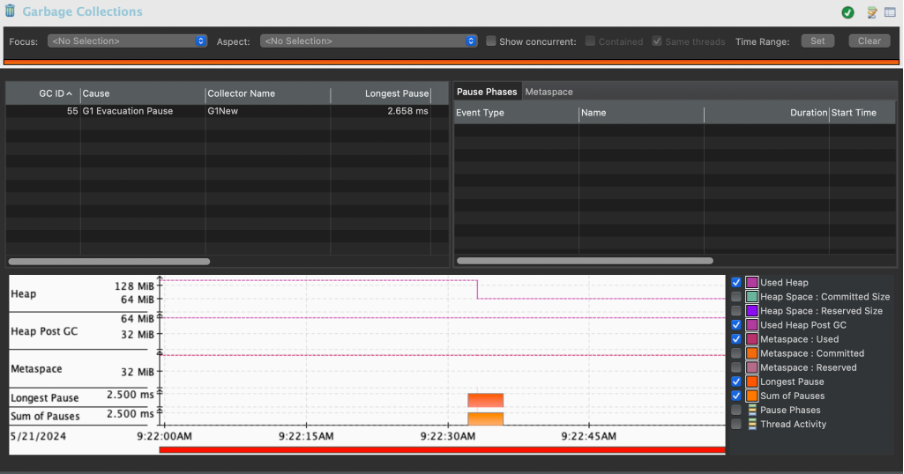
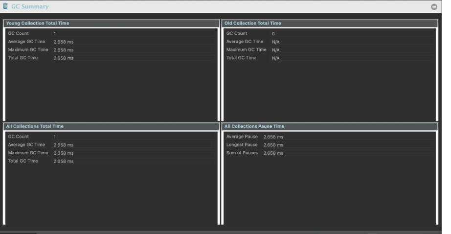
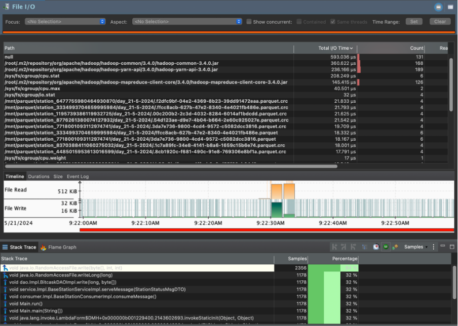

# Weather Stations Monitoring


## Table of Contents

- [Weather Stations Monitoring](#weather-stations-monitoring)
  - [Table of Contents](#table-of-contents)
  - [Overview](#overview)
  - [System Architecture](#system-architecture)
  - [Installation](#installation)
  - [Implementation](#implementation)
    - [Weather Station Mock](#weather-station-mock)
    - [Raining Triggers in Kafka Processors](#raining-triggers-in-kafka-processors)
    - [Central Base Station](#central-base-station)
      - [Bitcask archiving](#bitcask-archiving)
        - [KeyDirValue Content](#keydirvalue-content)
        - [Record Saved in Data Files](#record-saved-in-data-files)
      - [Parquet archiving](#parquet-archiving)
      - [Historical Weather Statuses Analysis](#historical-weather-statuses-analysis)
    - [Deploying with Kubernetes](#deploying-with-kubernetes)
    - [Profiling Central Station](#profiling-central-station)
      - [Top 10 Classes with Highest Total Memory Usage](#top-10-classes-with-highest-total-memory-usage)
      - [Garbage Collection (GC) Pauses](#garbage-collection-gc-pauses)
      - [Maximum Duration of a GC Pause](#maximum-duration-of-a-gc-pause)
      - [List of I/O Operations](#list-of-io-operations)
  - [License](#license)

## Overview

The Internet of Things (IoT) is an important source of data streams in the modern digital world. This project focuses on the architecture of a weather monitoring system. Each weather station emits readings for the current weather status to the central base station for persistence and analysis.

## System Architecture



The system is composed of three stages:

1. **Data Acquisition:** Multiple weather stations feed a queueing service (Kafka) with their readings.
2. **Data Processing & Archiving:** The central base station consumes the streamed data and archives all data in the form of Parquet files.
3. **Indexing:** Two variants of index are maintained:
   - Key-value store (Bitcask) for the latest reading from each individual station.
   - ElasticSearch / Kibana running over the Parquet files.

## Installation

To set up the cluster, you need:

1. Docker
2. Minikube

## Implementation

### Weather Station Mock

Each weather station acts as a Kafka producer, outputting a status message every second to a Kafka topic. The weather status message schema is as follows:

```json
{
  "station_id": 1,
  "s_no": 1,
  "battery_status": "low",
  "status_timestamp": 1681521224,
  "weather": {
    "humidity": 35,
    "temperature": 100,
    "wind_speed": 13
  }
}
```

The weather stations send these messages to a Kafka topic.
This ensures that all weather data is streamed in real-time to the Kafka server, allowing for efficient data processing and archiving at the central station.

### Raining Triggers in Kafka Processors

Kafka Processors is used to detect if humidity is higher than 70% and a special message is output to a specific topic in Kafka. This special message is shown as follow:
```High humidity detected at Station with sequence: {sequence_number}```

Sure! Here’s the updated README with the new section for BitCask and the relevant details moved from the Central Station section. All sections are placed inside the Base Station section.

---

### Central Base Station

The base station was responsible for processing, storing, and analyzing weather data from various weather stations. The implementation included the following components:

#### Bitcask archiving

We implemented BitCask Riak to store updated views of weather statuses. This allowed us to maintain an updated store of each station's status. Additionally, we archived all weather statuses history for all stations into Parquet files for efficient data storage and retrieval.

##### KeyDirValue Content

The KeyDirValue content is structured as follows:

|   fileID  | valueSize | valueOffset | timestamp |
| --------- | --------- | ----------- | --------- |
|  8 bytes  |  2 bytes  |   8 bytes   |  8 bytes  |

##### Record Saved in Data Files

Records saved in data files follow this format:

| timestamp  | keySize | key   | valueSize | value     |
| ---------- | ------- | ----- | --------- | --------- |
|   8 bytes  | 2 bytes | 8 bytes |  2 bytes  | variable  |

#### Parquet archiving

Records were written in batches to Parquet files, partitioned by station ID first then by time. This partitioning scheme facilitated efficient querying and retrieval of historical weather data.

#### Historical Weather Statuses Analysis

All weather statuses were directed to ElasticSearch for indexing, enabling powerful querying capabilities. Kibana was used for visualizing and analyzing the weather data, providing insightful dashboards and reports.
The following picture shows the kiabana dashboard:



### Deploying with Kubernetes

Write Dockerfiles and Kubernetes yaml files to deploy the services.

### Profiling Central Station

We profiled the central station using Java Flight Recorder (JFR). Here are the insights we gathered from the profiling process:

#### Top 10 Classes with Highest Total Memory Usage



#### Garbage Collection (GC) Pauses



#### Maximum Duration of a GC Pause



#### List of I/O Operations



## License

This project is licensed under the MIT License - see the [LICENSE](LICENSE) file for details.